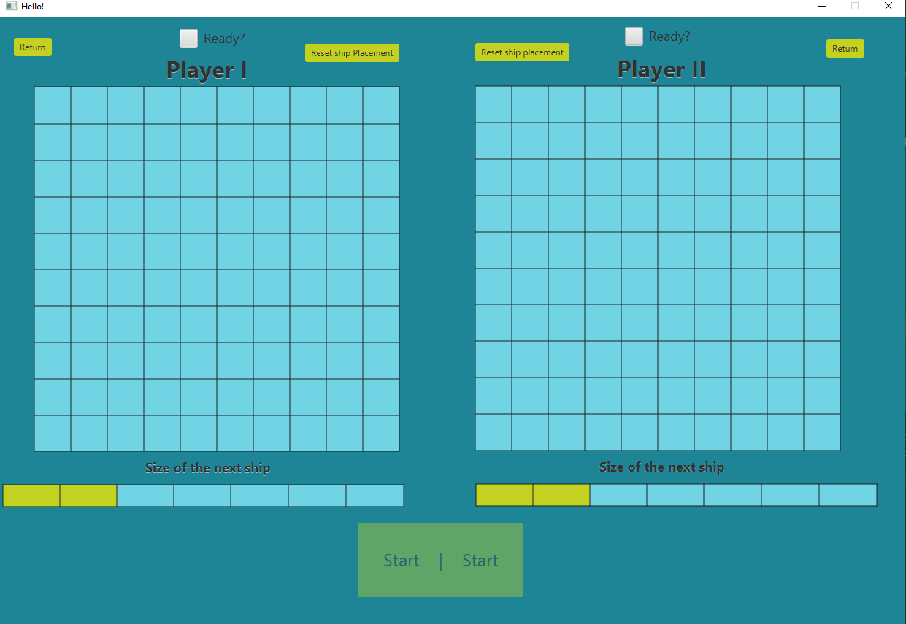

<h1 align="center">
 

"BattleShips"

</h1>

##Tłumaczenia
- [English](README.md)
- [Polish](README-pl.md)

## Menu

 
W menu gracz może wybrać następujące tryby rozgrywki:

   
 -Gracz vs Ai

   
 -Gracz vs Gracz

   
 -AI vs AI (test AI)

 
Lub  wyjść z gry

## Player vs Ai

Pierwszy gracz musi umieścić swoje statki na planszy. Można to zrobić za pomocą myszy, gracz może umieszczać statki lewym przyciskiem myszy i obracać je prawym przyciskiem myszy

Pod planszą gracz może zobaczyć rozmiar swojego następnego statku

     

Jeśli gracz nie jest zadowolony z umieszczania swoich statków, należy kliknąć 'Reset ships placement'. Ta akcja zresetuje pozycje wszystkich statków 

Kiedy gracz umieścił wszystkie swoje statki, możliwe jest kliknięcie przycisku Rozpocznij grę i Rozpocznij grę 

    

Po prawej stronie gracz może zobaczyć swoją planszę ze statkami, które umieścił

Po lewej stronie znajduje się plansza AI z ukrytymi statkami, gracz może „strzelać” do statków przeciwnika, klikając lewym przyciskiem wybrany kwadrat

Po ruchu gracza AI automatycznie wykona własny ruch

gra kończy się, gdy wszystkie statki jednej ze stron są zatopione

## Player vs Player

W tym trybie gry zaleca się, aby gracze podzielili widok na ekranie jakimś rodzajem przeszkody, rozgrywka rozgrywa się na jednym komputerze

  
Jak w wcześniejszym trybie rozgrywki gracze na początku powinni rozmieścić swoje statki 

pierwszy rozmieszcza swoje statki gracz nr 1, po odznaczeniu 'ready?', do rozstawiania statków może przystąpić gracz 2

     

jeśli obaj gracze umieścili swoje statki i potwierdzili to za pomocą check boxa znajdującego się nad tablicami, przycisk rozpoczęcia gry zostanie odblokowany

jeśli po odznaczeniu check boxa 'ready?', gracz chce zmienić położenie swoich statków, wymagane jest zresetowanie pozycji statków przy użyciu przycisku'Reset ships Placement'

    

 po rozpoczęciu gry obaj gracze mogą widzieć plansze przeciwnika(duża plansza), i ich własne(mała plansza) 

 Zielone koło wskazuje który z graczy może obecnie wykonać ruch

Tury graczy następują po sobie zaczynając od gracza nr 1

Jak w tradycyjnej grze gracze są zobowiązani do informowania swoich przeciwników gdy ich statek zostanie zatopiony

Gra kończy się gdy wszystkie statki jednego z graczy zostaną zatopione

## AI vs AI

W tym trybie rozgrywki obserwator ma wpływ na przewijanie tury, rozgrywki AI

    

Gra kończy się gdy wszystkie statki jednego z uczestników zostaną zatopione

## Kilka rzeczy o AI

<h3 align="center">
    AI ships placement
</h3>

AI ładuje nowe koordynaty dla statków z plików nazwanych scheme'number'.txt na przykład scheme1.txt

W każdym z tych plików znajdują się inne koordynaty dla statków, AI losuje jeden z nich i na jego podstawie rozmieszcza statki

Pliki te wyglądają następująco:

00 01  
03 04 
06 07 
09 19 
20 21 22 
24 25 26 
39 49 59 
40 50 60 70 
42 52 62 72 
44 54 64 74 84 94 

Każda para z liczb powyżej reprezentuje położenie pojedynczej części statku, na podstawie ilości par w linijce wiemy jak duży jest dany statek. 

Klasa FileValidator sprawdza czy te koordynaty są  poprawne przed umieszczeniem statków na tablicy

<h3 align="center">
    Jak AI celuje i strzela
</h3>

Proces ten może być następująco przedstawiony 

1.Wylosuj losową pozycje na planszy (*sprawdź czy Ai może tam strzelać), strzel 

2.Jeżeli Ai uderzyło statek gracza wybierz jeden z czterech kierunków i strzel najbliższe pole w tym kierunku 

3.Jeżeli strzał chybił wróć do dwójki wybierając inny kierunek,ale jeżeli statek został trafiony kontynuuj strzelanie w tym kierunku

4.Jeżeli strzał spudłował a statek nie został zatopiony wróć do pierwszego trafienia(punkt 2) i kontynuuj strzelanie w odwrotnym kierunku

5.Jeżeli statek został zatopiony wróć do punktu pierwszego

*Ai sprawdza czy wybrane miejsce nie zostało użyte już wcześniej(dokładniej czy na planszy nie ma znacznika trafienia bądź pudła)

## Użyte oprogramowanie

IntelliJ IDEA 2021.3.3

Java: sdk 17

javafx:17.0.2

## Jak uruchomić

Aplikacja powinna być uruchomiona z MainR(main ten jedynie uruchamia main HelloAplication, jednak jest on wymagany aby przekonwertować projekt do .jar, obecny program wbudowany w intelij ma problemy podczas przetwarzania aplikacji która rozszerza Aplication(pakiet Javafx)), jednak uruchomienie jej z HelloAplication także powinno działać poprawnie 

## Jak to zrobiliśmy

Na początku zaplanowaliśmy zrobić ten projekt konsolowo/tekstowo jako że były to minimalne wymagania, ale gdy skończyliśmy znacznie przed końcem terminu, postanowiliśmy przerobić projekt aby używał GUI

Przez to w kodzie nadal znajdowały się naleciałości z jego konsolowej wersji, postanowiliśmy ich nie usuwać, a jedynie zakomentować

