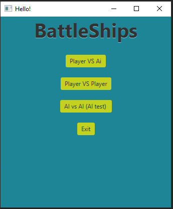
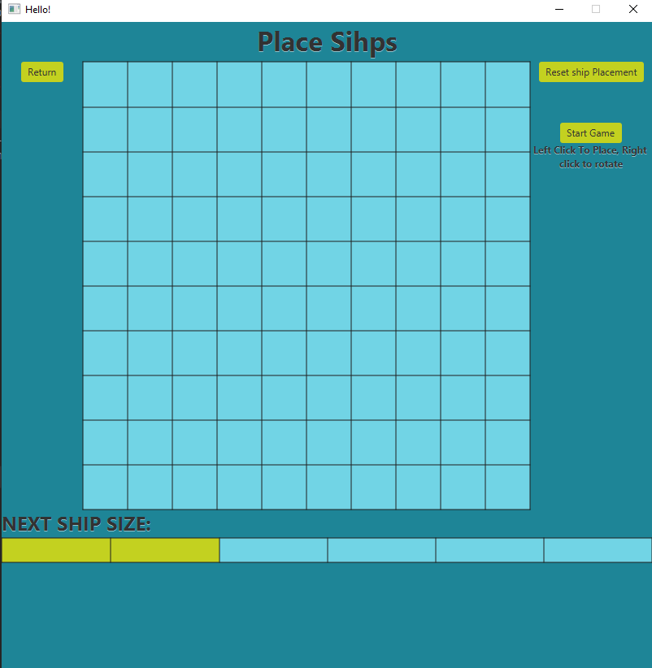
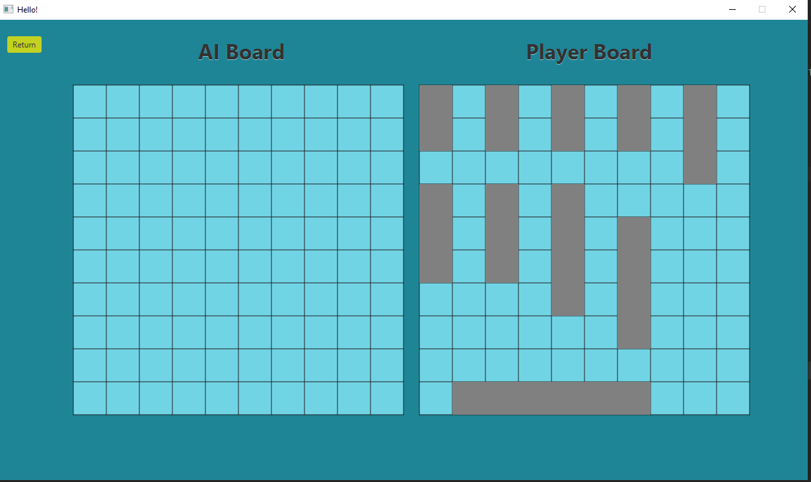
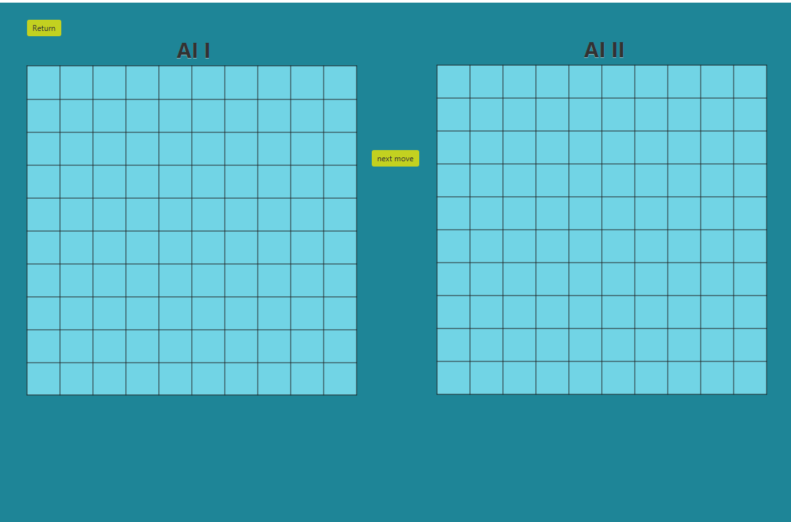

<h1 align="center">
 

"BattleShips"

 
 
</h1>

## Menu

 
In the Menu Player can choose one of the game modes:

   
 -Player vs Ai

   
 -Player vs Player

   
 -AI vs AI (test of AI)

 
or exit game

## Player vs Ai

First player must place his/her ships on the board. It is possible to do using mouse, player can place ships with left click and rotate them using right click

Below board player can see size of his next ship

    

If player is not content with placing of his/her ships,reset ships Placement should be clicked. This action will reset position of all ships 

when player placed all of his/her ships it is possible to click Start Game button, and Start the game 

    

On the right Player can see his/her board with ship he/she placed

On the left placed is AI board with hidden ships, place can 'shoot' the opponent ships by left clicking on choosen square

after player move AI will automatically make it own move

game stops after one of sides doesn't have any unsunked ships

## Player vs Player

In this game mode recomended is for players to separate view on screen with some type of obstacle

 
like before players first will place their ships 

    

if both player placed their ships and checked it using checker above boards the game start button will unlock

After checking ready? checkbox if player wants to change his/her ships, it is required to reset ships position, then board ships will be erased and board will unlock

    

Now both players can see their opponent board(big board), and their own board(small board at the bottom) 

 the green circle in the corners of window signals current shooter

players must do move after each other, starting with player 1

as in traditional game players are required to inform their opponents if one of their own ships were sunked

game stops after one of sides sunk all of enemy's ships

## AI vs AI

In this game mode the only thing observer can do is enabling next move of AI's

    

game stops after one of sides doesn't have any unsunken ships

## Few Things about AI-Opponent

<h3 align="center">
    AI ships placement
</h3>

AI loading new coordinates for ships placement from files named scheme'number'.txt for example scheme1.txt

in every file are different position of ships, AI draws one of theme and place ships accordingly

Those files look like this:

00 01  
03 04 
06 07 
09 19 
20 21 22 
24 25 26 
39 49 59 
40 50 60 70 
42 52 62 72 
44 54 64 74 84 94 

every pair of numbers represents coordinates for one part of the ship, depending on how many pairs are in line we know how big the ship is. 

Clss FileValidator checks if those coordinates are right before placing ships on the board

<h3 align="center">
    How AI Shoot
</h3>

this process can be summarised like that 

1.get random position on board(*check if ai can shoot there), and shoot 

2.if Ai hitted player ship choose one of four directions and shoot the closest squre in that direction 

3.if shot missed return to 2, but if ship was hitted keep shooting in that direction

4.if shot missed and enemy ship isn't sunked get back to first hit on this ship and continue step 2(in opposite direction)

if ship finally sunk go to step 1

*Ai checks if place choosen to be shooted hasn't been already picked before

## Used Software

Java: sdk 17

javafx:17.0.1

## How it was made

First we wanted to crate this project in console as it was minimum requirement, but after ending it quite early, with a lot of time to spare we have reworked to include GUI

